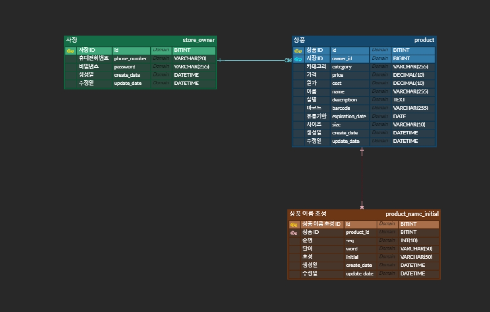

# 🚀 [페이히어] 백엔드 엔지니어 과제 전형

## 💻 개발 환경
- Java (17)
- Spring Boot (3.2.2)
- Gradle (8.5)
- MySql (5.7)
- JPA

***

## 과제 소개
    ```
    사장님은 카페를 운영하는 사장님입니다.
    사장님은 상품을 등록해서 가게를 운영하고 싶습니다.
    아래의 요구사항을 만족하는 DB 테이블과 REST API를 만들어주세요.
    ```
***

## 📄 권장 사용 언어 및 라이브러리
1. 언어 및 프레임워크는 아래와 같이 제한합니다.
    - Python : Django/DRF, FastAPI
    - Golang : Gin
    - Java/Kotlin : Spring Boot
2. DB는 `mysql:5.7` 로 제한합니다.
3. 이외 의존성은 모두 지원자분의 재량입니다. 다만 해당 의존성의 보안 등 신뢰성에 따라 평가 결과에 영향을 줄 수 있습니다.

***

## 📄 요구사항
1. 사장님은 시스템에 휴대폰번호와 비밀번호 입력을 통해서 회원 가입을 할 수 있습니다.
    - 사장님의 휴대폰 번호를 올바르게 입력했는지 확인해주세요
    - 비밀번호를 안전하게 보관할 수 있는 장치를 만들어주세요
2. 사장님은 회원 가입이후, 로그인과 로그아웃을 할 수 있습니다.
3. 사장님은 로그인 이후 상품관련 아래의 행동을 할 수 있습니다.
    - 상품의 필수속성(required)은 다음과 같습니다.
        1. 카테고리
        2. 가격
        3. 원가
        4. 이름
        5. 설명
        6. 바코드
        7. 유통기한
        8. 사이즈 : small or large
    - 사장님은 상품을 등록할 수 있습니다.
    - 사장님은 상품의 속성을 부분 수정할 수 있습니다.
    - 사장님은 상품을 삭제 할 수 있습니다
    - 사장님은 등록한 상품의 리스트를 볼 수 있습니다.
        + cursor based pagination 기반으로, 1page 당 10개의 상품이 보이도록 구현
    - 사장님은 등록한 상품의 상세 내역을 볼 수 있습니다.
    - 사장님은 상품 이름을 기반으로 검색할 수 있습니다.
        + 이름에 대해서 like 검색과 초성검색을 지원해야 합니다.
        + 예) 슈크림 라떼 → 검색가능한 키워드 : 슈크림, 크림, 라떼, ㅅㅋㄹ, ㄹㄸ
4. 로그인하지 않은 사장님의 상품 관련 API에 대한 접근 제한 처리가 되어야 합니다.

***

## 구현 요구사항
- 언어에 상관없이 Docker를 기반으로 서버를 실행 할 수 있도록 작성해주세요.
- DB 관련 테이블에 대한 DDL 파일을 소스 디렉토리 안에 넣어주세요.
- 테스트 케이스를 작성해주세요.
- JWT토큰을 발행해서 인증을 제어하는 방식으로 구현해주세요
- 각 API는 아래의 custom response json 형식으로 반환되야합니다.(204 No Content 제외)
    ```
    // 200 OK Example 
    {
       "meta":{
           "code": 200, // http status code와 같은 code를 응답으로 전달 
           "message":"ok" // 에러 발생시, 필요한 에러 메시지 전달 
            }, 
            "data":{
           "products":[...]
            }
    }
    
    // 400 Bad Request Example 
    {
       "meta":{
           "code": 400,
           "message": "잘못된 상품 사이즈 입니다."
            },
            "data": null 
    }
    ```

***

## 용어 사전
| 한글명     | 영문명             | 설명                                   |
|------------|--------------------|----------------------------------------|
| 사장       | storeOwner         | 상품을 관리할 수 있는 유저(사장)       |
| 상품       | product            | 메뉴 묶음, 분류                        |
| 카테고리   | category           | 상품의 구분                            |
| 가격       | price              | 상품의 판매가격                        |
| 원가       | cost               | 상품의 원가                            |
| 상품명     | name               | 상품의 이름                            |
| 설명       | description        | 상품에 대한 설명                       |
| 바코드     | barcode            | 상품의 바코드 번호                     |
| 유통기한   | expirationDate     | 상품의 유통기한                        |
| 사이즈     | size               | 상품의 크기 ( SMALL or LARGE)          |

***

## 연관 관계
- 사장(사용자)
    + 사장은 상품의 정보를 알고 있다.
    + 사장은 상품과 일대다(1:N) 양방향 관계다.
- 상품
    + 상품은 사장의 정보를 알고 있다.
    + 상품은 사장과 다대일(N:1) 양방향 관계다.

***

## ERD
- 상품의 변경 기록은 hibernate 의 envers 를 사용하여 관리하기로 하며, 해당되는 테이블은 ERD 에 별도로 추가하지 않음
- [ERD 링크](https://www.erdcloud.com/d/HDy9sdhqg43ffgwX4)


## Flow Chart


***

## 📈 To-Do
- [x] 테이블 설계 & DDL, ERD 작성
- [x] 플로우 차트 작성
- [x] 엔티티 연관관계 맵핑
- [x] 회원가입 기능 구현
    + 휴대폰번호 유효성 체크
    + 비밀번호 암호화
- [x] 로그인 기능 구현
    + 로그인 성공 시 액세스 토큰 발급 (유효기간 1시간)
- [x] 로그인 하지 않은 유저의 경우 상품 관련 API 접근 제한 추가
- [x] 상품 등록 기능 구현
- [x] 상품 속성 수정 기능 구현
    + 상품을 등록한 사장님만 수정 가능
- [x] 상품 삭제 기능 구현
    + 상품을 등록한 사장님만 수정 가능
- [ ] 상품 리스트 조회 기능 구현
    + pagination 구현. 1page당 10개의 상품 표시.
- [ ] 상품 상세 내역 조회 기능 구현
- [ ] 상품 검색 기능 구현
    + 상품 이름 기반으로 like 검색, 초성 검색 지원
- [ ] Docker 기반 실행 환경 구성
